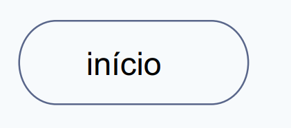
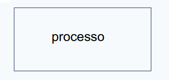
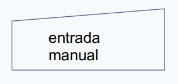
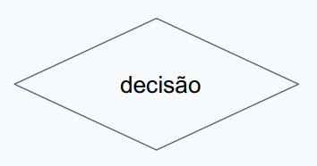

   
  
  

 

<h1 align="center"> Wipro Bootcamp </h1>

 

## 📝 Lógica de Programação

Lógica de programação é a organização coesa de uma sequência de instruções voltadas à resolução de um problema, ou à criação de um software ou aplicação.

Cada linguagem tem suas próprias particularidades, como sua sintaxe, seus tipos de dados e sua orientação, mas a lógica por trás de todas é a mesma.

A lógica de programação é importante porque é ela quem nos dá as ferramentas necessárias para executar o processo mais básico no desenvolvimento de alguma aplicação: a criação de seu algoritmo.

Tudo o que fazemos segue uma sequência lógica, por exemplo, quando acordamos pela manhã e vamos tomar uma xícara de café efetuamos uma certa sequência:

1. Ao acordar, levanto da cama;
2. Após levantar da cama, desço as escadas;
3. Após descer as escadas, entro na cozinha;
4. Após entrar na cozinha, pego o pó de café no armário;
5. Após pegar o pó de café, o coloco dentro da cafeteira;
6. Após colocar o pó na cafeteira, jogo água no compartimento específico;
7. Após inserir todos os ingredientes na máquina, aperto o botão de ligar;
8. Quando o café está pronto, pego a garrafa;
9. Após pegar a garrafa, despejo o café dentro de uma caneca;
10.Após colocar o café na caneca, bebo o café.

Se analisemos está sequência novamente vamos perceber que podemos incluir novos passos detalhados de como ficaria essa lógica e quando estamos desenvolvendo um software, devemos seguir o mesmo raciocínio para detalhar ao máximo os pontos fundamentais da sequência que será implementada.

Portanto, um algorismo de ser:

- **Completo**: Quando todas as ações precisam ser descritas e devem ser únicas. 
- **Sem redudância**: Quando um conjunto de instruções só pode ter uma única forma de ser interpretada. 
- **Determinístico**: Quando as instruções forem executadas, o resultado esperado será sempre atingido. 
- **Finito**: Quando as instruções precisam terminar após um número limitado de passos. 

Podemos dividir um algóritmo em três fases fundamentais:

- **Entrada**: Quando recebe as informações necessárias para iniciar o algoritmo.
- **Processamento**: Quando utilizamos os procedimentos utilizados para chegar ao resultado final.
- **Saida**: Que é o resultado esperado da fase de processamento com os dados já processados.

## 🖇️ Fluxograma

Um fluxograma é a representação gráfica de um procedimento, problema ou sistema, cujas etapas ou módulos são ilustrados de forma encadeada através de símbolos geométricos interconectados. Entre os mais utilizados temos:

  
  
  
   
  
  
  
   
  
  
  
   
  
  
  
   
  
  

## 📃 Pseudocódgo

O pseudocódigo é uma forma “genérica” de escrever um algoritmo, ou seja, utiliza uma linguagem simples, sem que exista a necessidade de conhecimento da sintaxe de linguagens de programação.

Um dos modelos de pseudocódigo mais conhecidos no Brasil é o Portugol. Além dele, podemos encontrar várias opções. O objetivo de todos, no entanto, é um só: criar um código que se aproxime do que será visto em linguagens de programação como C, C# ou Java.

Para utilizar um pseudocódigo requer que você conheça alguns comandos básicos, como, por exemplo:

- **escreva (” “)** = comando usado para imprimir uma mensagem na tela;
- **leia ()** = comando usado para ler valores digitados no teclado;
- **<-** = comando de atribuição;
- **inicio** = comando para iniciar o programa principal;
- **fimalgortimo** = comando para finalizar o algoritmo;
- **var** = comando para declarar variáveis;
- **algoritmo** = comando para indicar o início do programa

Aprender pseudocódigo é uma excelente maneira de iniciar o aprendizado. É uma ponte, que facilita e possibilita uma transição mais suave para o mundo das linguagens de programação.

## Atividade em Grupo no dia 30/03/2022

[Resolução da Atividade](../aula_logica_programacao/resposta%20exercicio%20de%20logica.pdf).

Realizado por:

🧑‍💻 Guilherme 

🧑‍💻 Icaro Nogueira

🧑‍💻 Leanderson Dias

🧑‍💻 Thiago Araujo

🧑‍💻 Viviane Bresolin

 

---

Todos os conceitos foram retirados do material de apoio da [Aula sobre lógica de programação](../aula_logica_programacao/Logica%20de%20Programacao.pdf).